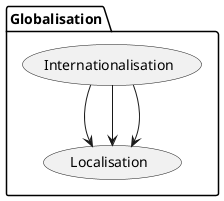

# Towards globalisation

An ultimate goal of any for-profit orgranisation is making money. There are two extremes to achieve it: sell limited luxury goods or services at a very high price, or sell something to mass market in a low price. In the software realm the latter usually is emboded in a strategy. An idea, at first, is examined in a startup form, and the goal is to reach the world market. The final step is also known as "going global" or "globalistation".

Internationalisation and localisation are the intrinsic steps to reach globalisation.
The terms have no strict defenitions these days [0]{#1} [1]{#1}. The difference in the notion can be found even in one company, for example Microsoft official documentation [2]{#2} and unofficial MSDN blogs of the employees [3]{#2}.

The author tried his best to get the mostly used defenitions of these words used today in the IT industry.

## Internationalisation (i18n)

Internationalisation implies that the software is functional with any language input and has easy localisation.

{class: information}
B> ### Numeronym
B> Internationalisation is also written as *i18n*, where 18 is the number of letters between i and n. This shortened form is called [numeronym](http://www.i18nguy.com/origini18n.html).
B> Localisation is often shortend to "l10n", and globalisation is alson known as "g11n".

The next points not required, but usually support the internationalisation process:

- Global support for almost any human language symbols. Unicode as the text encoding standard.
  Alloweness for the clients to post and read data in their languages.

- Support of world numeric, date, time and currency formats.
{icon: etsy}
B> A good application correctly understands the difference between European "DD/MM/YYY" ("DD-MM-YYYY") and the American "MM/DD/YYY" date formats.
B> An intenationalised product treats Chilean "1,5" and Australian "1.5" as the same number value "one and a half".

- Easy addition of UI localization resources.
  If a business unit requests tomorrow UI localisation for a new region, the software manufacture in the company should follow a ready and easy process to achieve it.
  Netflix operates in more than 190 countries and for UI localisation created the product called Hydra [4]{#4}. Java has the ResourceBundle class for adding a new language to a product, similarly Microsoft provides a built-in language resource creation possibility for .NET projects.

## Localisation (l10n)

Localisation is the process of a product adaptation to meet the language, cultural and other requirements of a specific target market. Localisation is also known as *l10n*, where 10 is the number of letters between l and n.

The next activities are often part of the localisation process:

- Translating an application's resources into localised versions.
  Updating UI text to the targeted language, verification of the UI items position and layout correctness.

- Conforming to local standars.
  In 2016, the EU General Data Protection Regulation (GDPR) was adopted to protect EU citizens data privacy [5]{#5}. In two years later, the Barreiro Hospital in Portugal was fined 400,000 € for leaving data access to former employees [6]{#6}. Many companies comply with GDPR, where one of the point demands a user's advice about private data usage. This led to the famous popup "we use browser cookies to spy on you for good" in most every site today.

  In 2016, the Russian goverment signed the "Russian GDPR", part of the "Yarovaya Law" [7]{#7} [8]{#8}. Microsoft and Facebook immediately moved personal citizens information to their in-state data centers,while LinkedIn was not ready for such changes and the government blocked the site.

  Another example involves the tax support for a new region. The sales tax, as it is known in the USA, varies from state to state. In Germany the VAT rate is the same across the country, and the calculation logic is different ("value-added tax" is another name for "sales tax"). Reaching a new market during localisation assumes that the software is extenable for new rules.

## Globalisation (g11n)

Globalisation, also called *g11n* or *going global*, is the process by which organizations connect with their customers and partners around the world.

Software globalisation often includes:

- Neutral attitude to every presentation aspect.
  No offensive product names or texts. It is not always possible to find a globally neutral product name, the company should be ready to change it for a local market.
  A neutral visualisation usually presents different genders, races or ethnic groups.
  No word or sign that can hurt people feelings or believes, for example, religion topics are avoided.

- Software design, development and customers support, at least in every continent.

## Flow

For a software product the plan to achieve *globalisation* is:

1. *(internationalisation)* prepare the plan and platform for localisation, periodically update the plan and the methods if needed
2. *(localisation)* - localise the product
3. *(localisation)* - localise the product
4. *(localisation)* - localise the product
5. ...

## References

{id: 0}
[Translating Vital Information:Localisation, Internationalisation, and Globalisation, Dimitra Anastasiou, Reinhard Schäler, Centre for Next Generation Localisation, 20.10.2009](http://d-anastasiou.com/Publications/Syntheses.pdf)

{id: 0.1}
[Origin Of The Abbreviation I18n](http://www.i18nguy.com/origini18n.html)

{id: 1}
[W3C Internationalisation notion](https://www.w3.org/International/questions/qa-i18n)

{id: 2}
[internationalizaton vs. localizability, Michael S. Kaplan, MSDN blog archive, 2005-09-09](http://archives.miloush.net/michkap/archive/2005/09/09/462862.html)

{id: 3}
[Globalizing and localizing .NET applications, .NET Guide](https://docs.microsoft.com/en-us/dotnet/standard/globalization-localization/index)

{id: 4}
[Hydra, Medium Netflix blog, June 4, 2015](https://medium.com/netflix-techblog/localization-technologies-at-netflix-d033e7b13cf)

{id: 5}
[GDPR](https://eugdpr.org)

{id: 6}
[Portuguese Data Protection Authority Imposes 400,000 € Fine on Hospital](https://www.datenschutz-notizen.de/portuguese-data-protection-authority-imposes-400000-e-fine-on-hospital-4821441/)

{id: 7}
[Yarovaya Law and new telecoms data storage requirements, International Law Office, August 08 2018](http://www.gorodissky.com/upload/articles/files/Yarovaya*Law*and*new*telecoms*data*storage*requirements.pdf)

{id: 8}
[Overview of the Package of Changes into a Number of Laws of the Russian Federation	Designed to	Provide for	Additional Measures to Counteract Terrorism](http://www.icnl.org/research/library/files/Russia/Yarovaya.pdf)
