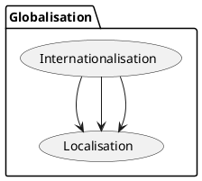

# Towards globalisation

An ultimate goal of any for-profit organisation is making money. There are two extremes to achieve it: sell limited luxury goods or services at a very high price, or sell something to the mass market at a low price. In the software realm, the latter usually is taken as a strategy. At first, a startup is created to test an idea, and then the product evolves to something bigger, reaches more markets and countries until almost any person in the world can use it. In business, the last step is called "going global", or simply "globalisation".

To achieve *globalisation* for a software product, a company, at first, should accomplish product *internationalisation* and *localisation*.
There are no strict definitions for the italicized terms these days [0]{#1} [1]{#1}, and people treat the notions differently ([2]{#2}, [3]{#3}).

The author has reviewed IT books, articles and many technical forums on this topic to get the actual meanings people tend to put in these words nowadays.

## Internationalisation (i18n)

*Software internationalisation implies that the product is functional with any language input and has easy localisation.*

{class: information}
B> Internationalisation is also known as *i18n*, where 18 is the number of letters between i and n. This shortened form is called [numeronym](http://www.i18nguy.com/origini18n.html).
B> Localisation is shortened to "l10n" (l + 10 letters + n), and globalisation is written as "g11n" respectively.

Following features support internationalisation:

- Acceptance of various human language symbols.
  {icon: etsy}
  Often UTF-8 is used as a text encoding standard for display and input symbols. Japanese clients should be able to write こんにちは (Hello) to their friends living in America, and the recipients should be able to read the letters without any additional actions.

- Acceptance of world numeric, date, time, and currency formats.
  {icon: etsy}
  B> Having default regional settings, Chilean clients should be able to put "1,5" value to the system, and Australian users should see it as "1.5".

- Easy addition of UI localization resources.
  {icon: etsy}
  B> Netflix operates in more than 190 countries, and for UI localisation created the product called Hydra [4]{#4}. Java has the ResourceBundle class for new languages. Similarly, Microsoft provides a fast and easy method to add new languages for .NET projects.

## Localisation (l10n)

*Localisation is the process of a product adaptation to meet the language and cultural requirements of a specific target market.*

To get localisation done, companies often adopt the following practices:

- Translation of messages and texts to the localised version.
- Verifying layout correctness for the targeted language.
  {icon: etsy}
   Chinese words regularly take less space than German words.

- Conforming to local standards.
  {icon: etsy}
  B> In 2016, the EU adopted the General Data Protection Regulation (GDPR)  to protect EU citizens data privacy [5]{#5}. In two years later, the Barreiro Hospital in Portugal was fined 400,000 € for providing data access to many former employees [6]{#6}.
One more GDPR requirement is to advise users about private data usage that resulted in the annoying pervasive popup "we use browser cookies to watch you for good".

  {icon: etsy}
  B> In 2016, the Russian government signed the "Russian GDPR" as part of the "Yarovaya Law" [7]{#7} [8]{#8}. Microsoft and Facebook immediately moved personal citizens data to their in-state data centres, while LinkedIn was not ready for such changes and the government blocked the site.

  {icon: etsy}
  B> Another example involves tax support for a new region. The sales tax in the USA varies from state to state. In contrast, in Germany, the value-added tax (VAT) rate is the same for the whole country, and the calculation logic is much different. This only a small example of a distinction between the two countries. It took several years for SAP, a Germany company, to be on the US market among the top enterprise systems.

## Globalisation (g11n)

*Globalisation is the process by which organizations connect with their customers and partners around the world.*

Software globalisation often realized in:

- Neutral attitude to every presentation aspect.
  {icon: etsy}
  B> It is not always possible to foresee all meanings of the word in various languages. Mitsubishi had to rename Pajero vehicle line to Montero for Spanish version because of the offensive sense. Likewise, Hyundai renamed the Kona model to Kauai on the Portuguese market.

- Software design, development, and customers support, at least in every continent.
  {icon: etsy}
  Google has over offices in more than 50 countries. Microsft offices are in more than ([Microsoft office locations around the world](https://www.microsoft.com/en-us/worldwide.aspx))

## Flow

For a software product, the plan to achieve *globalisation* is:

1. *(internationalisation)* prepare the plan and platform for localisation, periodically update the plan and the methods if needed
2. *(localisation)* - localise the product
3. *(localisation)* - localise the product
4. *(localisation)* - localise the product
5. ...

## References

{id: 0}
[Translating Vital Information:Localisation, Internationalisation, and Globalisation, Dimitra Anastasiou, Reinhard Schäler, Centre for Next Generation Localisation, 20.10.2009](http://d-anastasiou.com/Publications/Syntheses.pdf)

{id: 0.1}
[Origin Of The Abbreviation I18n](http://www.i18nguy.com/origini18n.html)

{id: 1}
[W3C Internationalisation notion](https://www.w3.org/International/questions/qa-i18n)

{id: 2}
[internationalizaton vs. localizability, Michael S. Kaplan, MSDN blog archive, 2005-09-09](http://archives.miloush.net/michkap/archive/2005/09/09/462862.html)

{id: 3}
[Globalizing and localizing .NET applications, .NET Guide](https://docs.microsoft.com/en-us/dotnet/standard/globalization-localization/index)

{id: 4}
[Hydra, Medium Netflix blog, June 4, 2015](https://medium.com/netflix-techblog/localization-technologies-at-netflix-d033e7b13cf)

{id: 5}
[GDPR](https://eugdpr.org)

{id: 6}
[Portuguese Data Protection Authority Imposes 400,000 € Fine on Hospital](https://www.datenschutz-notizen.de/portuguese-data-protection-authority-imposes-400000-e-fine-on-hospital-4821441/)

{id: 7}
[Yarovaya Law and new telecoms data storage requirements, International Law Office, August 08 2018](http://www.gorodissky.com/upload/articles/files/Yarovaya*Law*and*new*telecoms*data*storage*requirements.pdf)

{id: 8}
[Overview of the Package of Changes into a Number of Laws of the Russian Federation    Designed to    Provide for    Additional Measures to Counteract Terrorism](http://www.icnl.org/research/library/files/Russia/Yarovaya.pdf)
