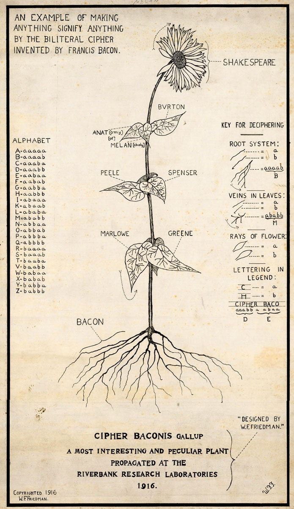
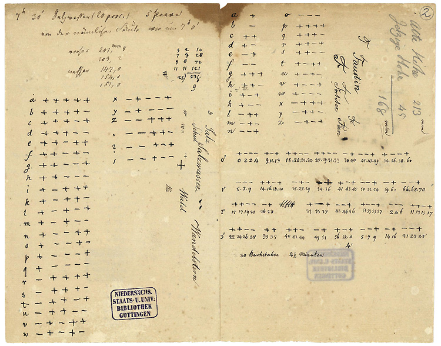
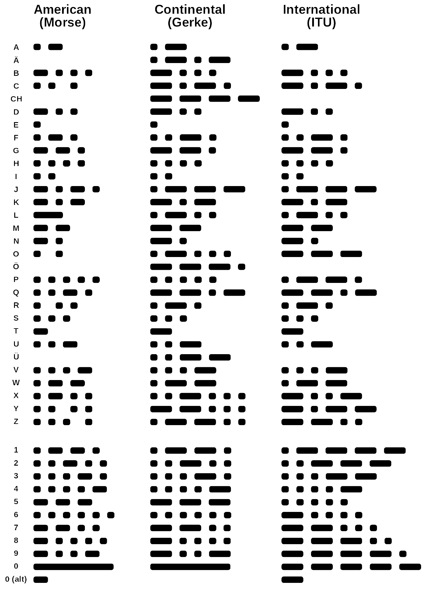

# Chapter 2 Unicode

## A brief history of character encoding

### Bi-literal cipher of Francis Bacon

In 1605, Francis Bacon, an English philosopher, scientist and statesman, devised the cipher that corresponds the English alphabete to a 5-bit code.

|Letter | Code | Binary|
|---|------ | ------|
| A | aaaaa | 00000 |
| B | aaaab | 00001 |
| C | aaaba | 00010 |
|   | ..... | ..... |
| F | aabab | 00101 |
|   | ..... | ..... |
| L | ababa | 01010 |
|   | ..... | ..... |
| Y | babba | 10110 |
| Z | babbb | 10111 |

The most powerful insight was that this cipher can be used for encoding by any two types of state: a pair of font style, "as by Bells, by Trumpets, by Lights and Torches, by the report of Muskets, and any inflruments of like nature".

Below is the example provided by Bacon. If a bold font syle denotes "a" and a normal font style denotes "b", then

**Do** n**o**t **g**o **t**i**l** I **c**ome  
↓  
aababababababba  
↓ (group by 5)  
aabab ababa babba  
↓  
f l y

Of the Proficience and Advancement of Learning, Divine and Human, Francis Bacon, 1605
https://archive.org/details/advancementofl00baco/page/256

In 1916, William Frederick Friedman, as US Army cryptographer, created an illustration how "anything can signify anything" with the Bacon's cipher.

  
Cipher Baconis Gallup, W.F. Friedman, 1916,  
The New York Public Library, https://digitalcollections.nypl.org/collections/bacon-cipher-collection  

### Gauss and Weber's code
In 1833, Carl Friedrich Gauss and Wilhelm Weber, two German scientists, succeeded in transmitting messages via an electromagnetic data line at Gottingen Observatory. Although the invented telegraph had no financial funding and no further development, the variable 5-bit character code was invented.

  
Gauss and Webber's code, Göttingen University

Technological archaeology: Technical description of the Gauss-Weber telegraph, Fernando Martín-Rodríguez1, Gonzalo Barrio García2, María Álvarez Lires,
2010, Second Region 8 IEEE Conference on the History of Communications

### Morse and Gerke's code

Samuel Morse invented the code for English alphabet, numbers and basic punctuations. In 1844, he send the first public American telegram from Washington to Ohio with the message "what hath God wrought?" ("what has God done?"). In American Morse code each symbol is represented by a sequence of pulses of 4 length variants (base 4).

In 1848, Friedrich Gerke, a German writer, musician and telegraph technician, revised Morse's code. The new simplified version had a sequence of only a short and a long signal variants (base 2). Later, Gerke's code was adopted to International Morse-Gerke Code.

From the encoding perspective, we have the same pair of bits, now presented by the signal duration.

  
Courtesy Spinningspark at Wikipedia

As an example, consider encoding of the famous emergency signal SOS that was introudced in the beginning of 20th century.

|S  | O  | S |
|:---:|:--:|:--:|
|... | - - - | ...|
|000 | 111 | 000|
|3 short | 3 long | 3 short

### Baudot code

Émile Baudot, a French telegraph engineer, invented multiplex system for theleraph with the new 5-bit code for Roman alphabet, punctuation and control signals and  The code was used in telegraph prior the ASCCI

1870 
 The Unicode project started in 1987 with the intention of supporting all living languages

| Tables        | Are           | Cool  |
| ------------- |:-------------:| -----:|
| col 3 is      | right-aligned | $1600 |
| col 2 is      | centered      |   $12 |
| zebra stripes | are neat      |    $1 |

